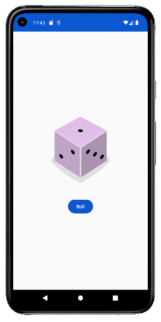

# Lemonade

Mini-Projet lié aux tutos proposés par la formation Google Developer Android
(code non identique à celui corrigé)

## Principe

Simulation d'un tirage de dé aléatoire à chaque clic sur "Roll"

## Aperçu

